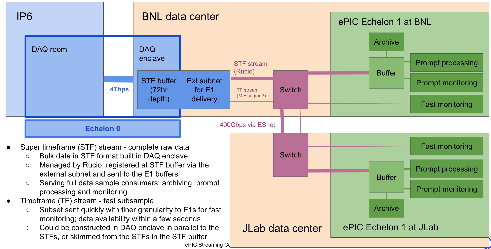

# swf-testbed

This is the umbrella repository for the ePIC streaming workflow testbed.

The testbed plan is based on ePIC streaming computing model WG discussions
in the streaming computing model meeting[^1], guided by the ePIC streaming
computing model report[^2], and the ePIC workflow management system
requirements draft[^3].

## Testbed plan

The testbed prototypes the ePIC streaming computing model's workflows and
dataflows from Echelon 0 (E0) egress (the DAQ exit buffer)
through the processing that takes place at the two Echelon 1 computing
facilities at BNL and JLab.

The testbed scope, timeline and workplan are described in a planning
document[^4]. Detailed progress tracking and development discussion is in a
progress document[^5].

See the E0-E1 overview slide deck [^6] for more information on the E0-E1
workflow and dataflow.
The following is a schematic of the system the testbed targets (from the blue
DAQ external subnet rightwards).



*Figure: E0-E1 data flow and processing schematic*

## Design and implementation

Overall system design and implementation notes:

- The implementation language is Python 3.9 or greater.
- Testbed modules are implemented as a set of loosely coupled agents, each
  with a specific role in the system.
- The agents communicate via messaging, using ActiveMQ as the message
  broker.
- The PanDA [^7] distributed workload management system and its ancillary
  components are used for workflow orchestration and workload execution.
- The Rucio [^8] distributed data management system is used for
  management and distribution of data and associated metadata, in close
  orchestration with PanDA.
- High quality monitoring and centralized management of system data (metadata,
  bookkeeping, logs etc.) is a primary design goal. Monitoring and system
  data gathering and distribution is implemented via a web service backed
  by a relational database, with a REST API for data access and reporting.

### Participants

At present the testbed is a project of the Nuclear and Particle Physics
Software (NPPS) group at BNL; collaborators are welcome.

- Torre Wenaus (lead)
- Maxim Potekhin
- Ejiro Umaka
- Michel Villanueva
- Xin Zhao

## Software organization

The streaming workflow (swf prefix) set of repositories make up the software
for the ePIC streaming workflow testbed project.

The repositories mapping to testbed components are:

### [swf-monitor](https://github.com/BNLNPPS/swf-monitor)

This is a web service providing system monitoring and comprehensive
information about the testbed's state, both via browser-based dashboards and a
json based REST API.

This module manages the databases used by the testbed, and offers a REST API
for other agents in the system to report status and retrieve information.

### [swf-daqsim-agent](https://github.com/BNLNPPS/swf-daqsim-agent)

This is the information agent designed to simulate the Data Acquisition (DAQ)
system and other EIC machine and ePIC detector influences on streaming
processing. This dynamic simulator acts as the primary input and driver of
activity within the testbed.

#### Implementation notes

- Base it on the [pysim](https://pypi.org/project/pysim/) dynamical system
  modeler.

### [swf-data-agent](https://github.com/BNLNPPS/swf-data-agent)

This is the central data handling agent within the testbed. It listens to
the swf-daqsim-agent, manages Rucio subscriptions of run datasets and STF
files, creates new run datasets, and sends messages to the
swf-processing-agent for run processing and to the swf-fastmon-agent for new
STF availability. It also has a 'watcher' role to identify and report
stalls or anomalies.

Interactions with Rucio are consolidated in this agent.

### [swf-processing-agent](https://github.com/BNLNPPS/swf-processing-agent)

This is the prompt processing agent that configures and submits PanDA
processing jobs to execute the streaming workflows of the testbed.

Interactions with PanDA are consolidated in this agent.

### [swf-fastmon-agent](https://github.com/BNLNPPS/swf-fastmon-agent)

This is the fast monitoring agent designed to consume (fractions of) STF data
for quick, near real-time monitoring. This agent resides at E1 and performs
remote data reads from STF files in the DAQ exit buffer, skimming a fraction
of the data of interest for fast monitoring. The agent is notified of new
STF availability by the swf-data-agent.

### [swf-mcp-agent](https://github.com/BNLNPPS/swf-mcp-agent)

This agent may be added in the future for managing Model Context Protocol (MCP) services. For the moment, this is done in swf-monitor (Colocated with the agent data the MCP services provide)


Note Paul Nilsson's [ask-panda example](https://github.com/PalNilsson/ask-panda) of
  MCP server and client.

## System infrastructure

This repository hosts overall system infrastructure for the testbed software,
including the following.

### Agent process management

The testbed agents are managed by a process manager, which is
responsible for configuring, starting, stopping, and monitoring the agents.

The python [supervisor](http://supervisord.org/) process manager is used.

### Message Broker

The [ActiveMQ](https://activemq.apache.org/) message broker provides the messaging backbone for the testbed agents to communicate.

#### Local Development Broker

For local development and testing, a standalone broker can be run using Docker.
This is managed by the `docker-compose.yml` file in this repository. To start
the local broker, run:

```bash
docker-compose up -d
```

When using the local broker, the agents should be configured with the following
environment variables:

```bash
export ACTIVEMQ_HOST=localhost
export ACTIVEMQ_PORT=61616
export ACTIVEMQ_USER=admin
export ACTIVEMQ_PASSWORD=admin
```

#### Production Broker

In a production environment, the agents should be configured to use the centrally
provided ActiveMQ service. This is done by setting the same environment variables
 to point to the production broker's host, port, and credentials.

Each agent (e.g., `swf-monitor`, `swf-data-agent`) will need to be configured
to read these environment variables and use them to connect to the broker. The
`swf-monitor` application, for example, reads these values from its Django
`settings.py` file, which in turn can be populated from environment variables.

## Glossary

- STF: super time frame. A contiguous set of ~1000 TFs containing about ~0.6s
  of ePIC data, corresponding to ~2GB. The STF is the atomic unit of
  streaming data processing.
- TF: time frame. Atomic unit of ePIC detector readout ~0.6ms in duration.

## References

[^1]: [ePIC streaming computing model meeting page](https://docs.google.com/document/d/1t5vBfgro8Kb6MKc-bz2Y67u3cOCpHK4dfepbJX-nEbE/edit?tab=t.0#heading=h.y3evqgz3sc98)

[^2]: [ePIC streaming computing model report](https://zenodo.org/records/14675920)

[^3]: [ePIC workflow management system requirements draft](https://docs.google.com/document/d/1OmAGzFgZgEP6ntuRkP51kiOqF_0uh_RPjq8wgdTwb2A/edit?tab=t.0#heading=h.g1vlz8vqp7ht)

[^4]: [ePIC streaming workflow testbed planning document](https://docs.google.com/document/d/1mPqMsjHiymkeAB7uih_8TjFIluwM8MENIWZF3EDwNrU/edit?tab=t.0)

[^5]: [ePIC streaming workflow testbed progress document](https://docs.google.com/document/d/1PUoo-W6dCeOKsD4VubYTgSxBHBUb4D5dYfVy1oLYh7E/edit?tab=t.0#heading=h.qovfena71s)

[^6]: [E0-E1 overview slide deck](https://docs.google.com/presentation/d/1Vbt68LwBDA-eDghlWWg8278ys_K0axbX/edit?slide=id.g2fdc8697d63_0_18#slide=id.g2fdc8697d63_0_18)

[^7]: [PanDA: Production and Distributed Analysis System](https://link.springer.com/article/10.1007/s41781-024-00114-3)
  [PanDA documentation](https://panda-wms.readthedocs.io/en/latest/index.html)
  [BNL PanDA startup guide](https://docs.google.com/document/d/1zxtpDb44yNmd3qMW6CS7bXCtqZk-li2gPwIwnBfMNNI/edit?tab=t.0#heading=h.iiqfpuwcgs2k)

[^8]: [Rucio: A Distributed Data Management System](https://link.springer.com/article/10.1007/s41781-019-0026-3)
    [Rucio home](https://rucio.cern.ch/)
