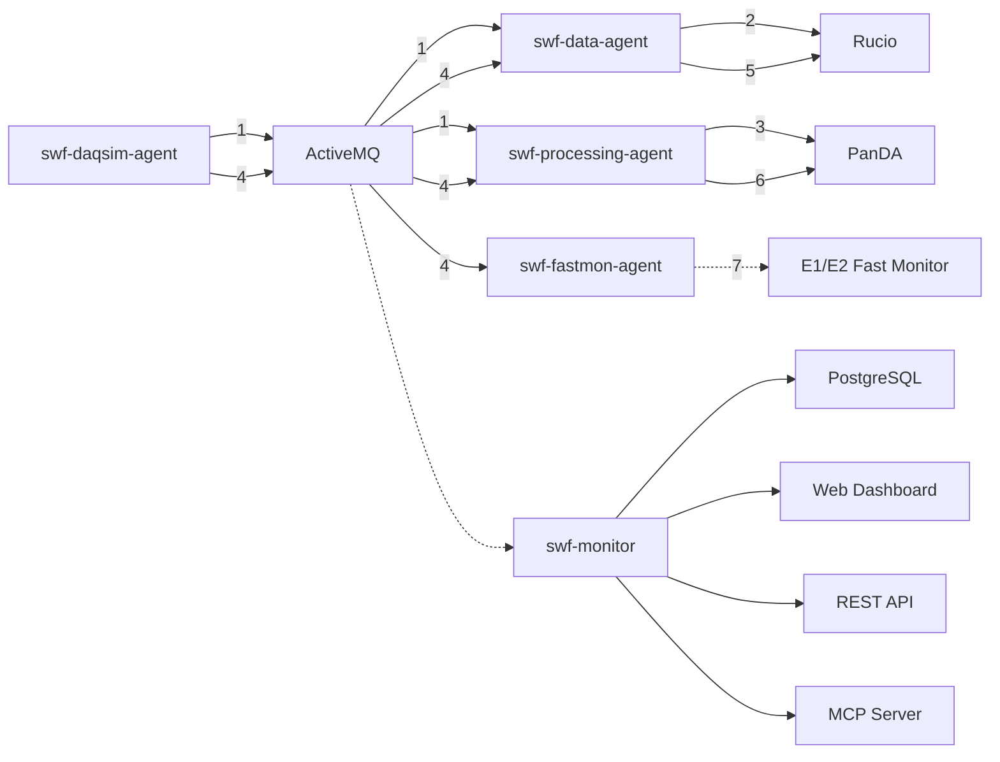

# Architecture Overview

System design and components of the SWF Testbed.

## Overview

The testbed plan is based on ePIC streaming computing model WG discussions
in the streaming computing model meeting[^1], guided by the ePIC streaming
computing model report[^2], and the ePIC workflow management system
requirements draft[^3].

## Testbed plan

The testbed prototypes the ePIC streaming computing model's workflows and
dataflows from Echelon 0 (E0) egress (the DAQ exit buffer)
through the processing that takes place at the two Echelon 1 computing
facilities at BNL and JLab.

The testbed scope, timeline and workplan are described in a planning
document[^4]. Detailed progress tracking and development discussion is in a
progress document[^5].

See the E0-E1 overview slide deck [^6] for more information on the E0-E1
workflow and dataflow.
The following is a schematic of the system the testbed targets (from the blue
DAQ external subnet rightwards).


*Figure: E0-E1 data flow and processing schematic*

## Design and implementation

Overall system design and implementation notes:

- We aim to follow the [Software Statement of Principles](https://eic.github.io/activities/principles.html) of the EIC and ePIC in the design and
  implementation of the testbed software.
- The implementation language is Python 3.9 or greater.
- Testbed modules are implemented as a set of loosely coupled agents, each
  with a specific role in the system.
- The agents communicate via messaging, using ActiveMQ as the message
  broker.
- The PanDA [^7] distributed workload management system and its ancillary
  components are used for workflow orchestration and workload execution.
- The Rucio [^8] distributed data management system is used for
  management and distribution of data and associated metadata, in close
  orchestration with PanDA.
- High quality monitoring and centralized management of system data (metadata,
  bookkeeping, logs etc.) is a primary design goal. Monitoring and system
  data gathering and distribution is implemented via a web service backed
  by a relational database, with a REST API for data access and reporting.

## Software organization

The streaming workflow (swf prefix) set of repositories make up the software for the ePIC
streaming workflow testbed project, development begun in June 2025.
This swf-testbed repository serves as the umbrella repository for the testbed.
It's the central place for documentation, overall configuration,
and high-level project information.

The repositories mapping to testbed components are:

### [swf-monitor](https://github.com/BNLNPPS/swf-monitor)

A web service providing system monitoring and comprehensive information about the testbed's state, both via browser-based dashboards and a json based REST API.

This module manages the databases used by the testbed, and offers a REST API for other agents in the system to report status and retrieve information. It acts as a listener for the ActiveMQ message broker, receiving messages from other agents, storing relevant data in the database and presenting message histories in the monitor. It hosts a Model Context Protocol (MCP) server for the agents to share information with LLM clients to create an intelligent assistant for the testbed.

### [swf-daqsim-agent](https://github.com/BNLNPPS/swf-daqsim-agent)

This is the information agent designed to simulate the Data Acquisition (DAQ)
system and other EIC machine and ePIC detector influences on streaming
processing. This dynamic simulator acts as the primary input and driver of
activity within the testbed.

### [swf-data-agent](https://github.com/BNLNPPS/swf-data-agent)

This is the central data handling agent within the testbed. It listens to
the swf-daqsim-agent, manages Rucio subscriptions of run datasets and STF
files, create new run datasets, and sends messages to the
swf-processing-agent for run processing and to the swf-fastmon-agent for new
STF availability. It will also have a 'watcher' role to identify and report
stalls or anomalies.

### [swf-processing-agent](https://github.com/BNLNPPS/swf-processing-agent)

This is the prompt processing agent that configures and submits PanDA
processing jobs to execute the streaming workflows of the testbed.

### [swf-fastmon-agent](https://github.com/BNLNPPS/swf-fastmon-agent)

This is the fast monitoring agent designed to consume (fractions of) STF data
for quick, near real-time monitoring. This agent will reside at the E1s and perform
remote data reads from STF files in the DAQ exit buffer, skimming a fraction
of the data of interest for fast monitoring. The agent will be notified of new
STF availability by the swf-data-agent.

### [swf-mcp-agent](https://github.com/BNLNPPS/swf-mcp-agent)

This agent may be added in the future for managing Model Context Protocol
(MCP) services. For the moment, this is done in swf-monitor (colocated with
the agent data the MCP services provide).

Note Paul Nilsson's [ask-panda example](https://github.com/PalNilsson/ask-panda) of
MCP server and client; we want to integrate it into the testbed. Tadashi Maeno has also implemented MCP capability on the core PanDA services, we will want to integrate that as well.

### Testbed System Architecture

### Deployment Modes

The testbed supports two deployment modes:

**Development Mode** (Docker-managed infrastructure):
- PostgreSQL and ActiveMQ run as Docker containers
- Managed by `docker-compose.yml`
- Started/stopped via `swf-testbed start/stop`
- Ideal for development and testing environments

**System Mode** (System-managed infrastructure):
- PostgreSQL and ActiveMQ run as system services (e.g., `postgresql-16.service`, `artemis.service`)
- Managed by system service manager (systemd)
- Testbed manages only agent processes via `swf-testbed start-local/stop-local`
- Typical for shared development systems like pandaserver02

Both modes use supervisord to manage Python agent processes. Use `python report_system_status.py` to verify service availability and determine which mode is active.

### Database Schema
The database schema for the monitoring system is automatically maintained in the swf-monitor repository. View the current schema:
- [testbed-schema.dbml](https://github.com/BNLNPPS/swf-monitor/blob/main/testbed-schema.dbml)

To generate the schema manually:
```bash
cd swf-monitor/src
python manage.py dbml > ../testbed-schema.dbml
```

To visualize the schema, paste the DBML content into [dbdiagram.io](https://dbdiagram.io/).

The following diagram shows the testbed's agent-based architecture and data flows:



*Figure: Testbed agent architecture and data flow diagram*

**Workflow Steps:**
1. **Run Start** - daqsim-agent generates a run start broadcast message indicating a new datataking run is beginning
2. **Dataset Creation** - data-agent sees the run start message and has Rucio create a dataset for the run
3. **Processing Task** - processing-agent sees the run start message and establishes a PanDA processing task for the run
4. **STF Available** - daqsim-agent generates a broadcast message that a new STF data file is available
5. **STF Transfer** - data-agent sees the message and initiates Rucio registration and transfer of the STF file to E1 facilities
6. **STF Processing** - processing-agent sees the new STF file in the dataset and transferred to the E1 by Rucio, and initiates a PanDA job to process the STF
7. **Fast Monitoring** - fastmon-agent sees the broadcast message that a new STF data file is available and performs a partial read to inject a data sample into E1/E2 fast monitoring

## References

[^1]: [ePIC streaming computing model meeting page](https://docs.google.com/document/d/1t5vBfgro8Kb6MKc-bz2Y67u3cOCpHK4dfepbJX-nEbE/edit?tab=t.0#heading=h.y3evqgz3sc98)

[^2]: [ePIC streaming computing model report](https://zenodo.org/records/14675920)

[^3]: [ePIC workflow management system requirements draft](https://docs.google.com/document/d/1OmAGzFgZgEP6ntuRkP51kiOqF_0uh_RPjq8wgdTwb2A/edit?tab=t.0#heading=h.g1vlz8vqp7ht)

[^4]: [ePIC streaming workflow testbed planning document](https://docs.google.com/document/d/1mPqMsjHiymkeAB7uih_8TjFIluwM8MENIWZF3EDwNrU/edit?tab=t.0)

[^5]: [ePIC streaming workflow testbed progress document](https://docs.google.com/document/d/1PUoo-W6dCeOKsD4VubYTgSxBHBUb4D5dYfVy1oLYh7E/edit?tab=t.0#heading=h.qovfena71s)

[^6]: [E0-E1 overview slide deck](https://docs.google.com/presentation/d/1Vbt68LwBDA-eDghlWWg8278ys_K0axbX/edit?slide=id.g2fdc8697d63_0_18#slide=id.g2fdc8697d63_0_18)

[^7]: [PanDA: Production and Distributed Analysis System](https://link.springer.com/article/10.1007/s41781-024-00114-3)
  [PanDA documentation](https://panda-wms.readthedocs.io/en/latest/index.html)
  [BNL PanDA startup guide](https://docs.google.com/document/d/1zxtpDb44yNmd3qMW6CS7bXCtqZk-li2gPwIwnBfMNNI/edit?tab=t.0#heading=h.iiqfpuwcgs2k)

[^8]: [Rucio: A Distributed Data Management System](https://link.springer.com/article/10.1007/s41781-019-0026-3)